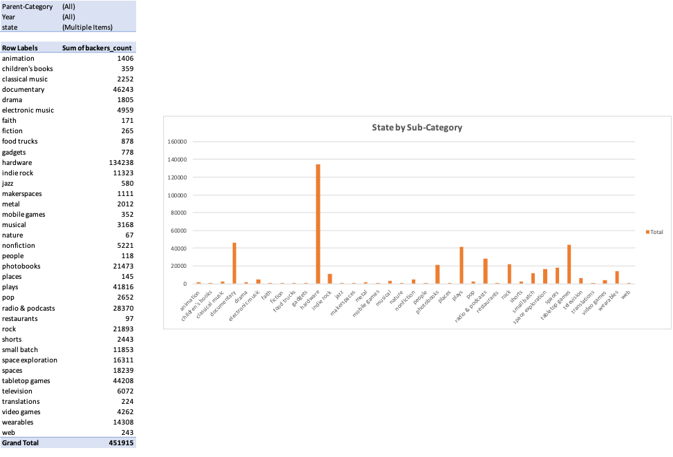

# Kickstarter-Analysis

## Background

Over $2 billion has been raised using the massively successful crowdfunding service, Kickstarter, but not every project has found success. Of the more than 300,000 projects launched on Kickstarter, only a third have made it through the funding process with a positive outcome.

Getting funded on Kickstarter requires meeting or exceeding the project's initial goal, so many organizations spend months looking through past projects in an attempt to discover some trick for finding success. The analysis will be based on a database of 4,000 past projects in order to uncover any hidden trends.

## Analysis

Here is the data sheets and figures to conduct the Kickstarter analysis. 

## Conclusions

The conclusions will be conducted based on the Kickstarter campaign data collected from 2009 to 2017.

Regarding State per Category Chart, the majority of the campaigns is in the theater business. Also, the highest number of success is in the theater business as well.

Regarding State per Sub-Category chart, “plays” is the most successful sub-category campaign compared to others.

Regarding State by Month from all those years, the highest number of successful campaigns takes place in May.

## Limitations

1. There are approximately 4,000 projects in the dataset which might be inadequate to represent all the Kickstarter projects. That might mislead the conclusion. 

2. The duration of each campaign is different which makes it difficult to standardize the analysis of the entire dataset.

3.	The number of backers and how much they pledge depend on their interests at the time the campaign launches. Another variable factor that should be considered will be what the trend is at that point of time. Therefore, using only provided data could lead to irrational conclusions.

## Other tables and graphs

# Predict Trend by Category

Creating a pivot table with a column of 'state', row of 'year', value based on the count of 'state' and filters based on 'Parent-Category' 

Also, creating a line chart linked with the pivot table to analyze trend of successful and failure by filtering 'Parent-Category'.

This table and graph will conduct the trend of success and fail for each category from 2009 to 2017.

# Analysis of state by Parent and Sub category for each country

Creating a pivot table with a column of 'state', row of 'country', value based on the count of 'state' and filters based on 'Parent-Category' and 'Sub-category'.

Also, creating a stacked chart linked with the pivot table to analyze which campaigns in which country tend to be more successful or failed by filtering 'Parent-Category' and 'Sub-category'.

This table and graph will conduct which campaign will be more interesting compared to others in each country.

# Analysis of backers’ interests toward the campaign category

Creating a pivot table with a row of 'Sub-category', value based on the sum of 'backer' and filters based on 'Parent-Category' and 'year'.

Also, creating a column chart linked with the pivot table to analyze which campaigns tend to be more interesting for the backers by filtering 'Parent-Category' and 'year.

This table and graph will conduct which campaign (sub-category) will draw more backer’s attention than the others.

