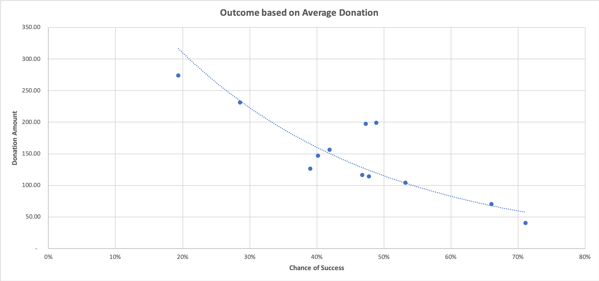

# Kickstarter Project Analysis

## Background

Kickstarter, founded in April 2009, is a platform that gives an opportunity for people who have an idea of creative work and get the community to support them. Over $2 million and million people have been involved in campaign funding. However, not all of the campaigns launched on this platform are successful. Only one third of more than 300,000 projects launched on Kickstarter have reached their goal. Therefore, the analysis will be focused on a database of 4,000 past projects in order to uncover any hidden trends.

## Analysis

Here is the data sheets and figures to conduct the Kickstarter analysis. [Click here to Download Analysis Table](https://github.com/abpuccini/Kickstarter-Analysis/raw/master/KickstarterTableAnalysis.xlsx)

## Conclusion

The conclusions will be conducted based on the Kickstarter campaign data collected from 2009 to 2017.

Regarding State per Category Chart, the **majority** of the campaigns is in the **theater** business. Also, the **highest number of success** is in the **theater** business as well.

Regarding State per Sub-Category chart, **plays** is **the most successful** sub-category campaign compared to others.

Regarding State by Month from all those years, the highest number of successful campaigns takes place in **May**.

## Limitations

- There are approximately 4,000 projects in the dataset which might be inadequate to represent all the Kickstarter projects which is 300,000 projects. That might mislead the conclusions of this analysis. The more accurate analysis might require a larger size of dataset. 
- In 2009 and 2017, the dataset does not contain a full year data. That could lead to misinterpret trends or forecasting.
- The goal, created date and ended date of each campaign are different which makes it difficult to standardize the analysis of the entire dataset. That might lead to a generalization.  
- The number of projects launched each year is different. In order to have a more accurate analysis, the dataset might be required to exclude any year that has a significant difference of launched project number.

## Other tables and graphs

### Predict Trend by Category

Creating a pivot table with a column of *state*, row of *year*, value based on the count of *state* and filters based on *Parent-Category*. Also, creating a line chart linked with the pivot table to analyze trend of successful and failure by filtering *Parent-Category*.

This table and graph will conduct the trend of success and fail for each category from 2009 to 2017.

It seems the trends of success and failure **climb up from 2009 to the highest point in 2015 and start to drop in 2016**. 

### Analysis of state by Parent and Sub category for each country

Creating a pivot table with a column of *state*, row of *country*, value based on the count of *state* and filters based on *Parent-Category* and *Sub-category*. Also, creating a stacked chart linked with the pivot table to analyze which campaigns in which country tend to be more successful or failed by filtering *Parent-Category* and *Sub-category*.

This table and graph will conduct which campaign will be more interesting compared to others in each country.

The highest chance of success of each project falls into **the U.S.** However, there are more projects created in the U.S. compared to other countries.

### Analysis of backers’ interests toward the campaign category

Creating a pivot table with a row of *Sub-category*, value based on the sum of *backer* and filters based on *Parent-Category*, *year* and *state* Also, creating a column chart linked with the pivot table to analyze which campaigns tend to be more interesting for the backers by filtering *Parent-Category* and *year.

This table and graph will conduct which campaign (sub-category) will draw more backer’s attention than the others in order to be successful.

**Hardware** which is in Technology parent-category is the most interesting project for backers to support it.

- - - 

## Additional Analysis

**Table I: Outcome based on Goal**

**Graph I: Outcome based on Goal**

**Graph II: Outcome based on Average Donation**

Regarding Table I and Graph I, the data indicates that there is a relationship between the goal and chance of success or failed. If the goal amount is low, it is likely that the project will reach the goal and succeed. On the other hand, if the goal amount is high, the chance of success will decline and the chance of failure will increase. Also, the average donation per backer is related to a chance of success as well. Regarding Graph II, it implies that the lower amount of pledge for each backer, the higher chance of success will be. These emphasize that the project’s goal amount is a significant variability to reach the positive outcome on Kickstarter.

## Statistical Analysis

**Table II: Staistical Table**

**Assumption I** Does mean or median give meaningful analysis?

Regarding Table II, variance and standard deviation of each state is large which means the data in the dataset is far from mean and median. Also, it means that the data set has a high number of outliers. Therefore, mean and median for this dataset might not be an efficient indicator for analysis. However, the dataset could be used for an analysis if the outlier data is excluded from the dataset.

**Assumption II** Is there any variability that relates to a chance of success or failure?

Even though there are similar projects in terms of their launch time, goal, parent-category and sub-category, one project was successful, another one was not. There are other variabilities that could affect the outcome of the project. 

One of the variabilities could be the content or product of the project which relates to what people are interested in at that period of time. Therefore, the number of backers and how much they pledge depend on their interests at the time. Also, the backers have no limitation of which country they can pledge. In the other words, the backers can pledge domestically or internationally. If a project fits with the global trend, the successful rate of the project might be higher than the one that does not follow the trend. As a result, using only provided data could lead to inaccurate conclusions.

Another variability is the creator. In this dataset, it does not contain information about who creates each project. However, the backers are able to see creators and follow them on Kickstarter. If a creator is a well-known person or team, the backer might be more interested in that project more than others which could create more chances of success. Therefore, the creator could be a significant factor to make to the project either success or failed.

In conclusion, only the provided dataset might be inadequate to make a conclusion on how the Kickstarter’s projects will be successful or failed. There will be other variabilities that might be a significant factor resulting in the chance of success.

- - -

## Reference

*About Us*.(2020).Kickstarter. Retrived September 9, 2020, from https://www.kickstarter.com/about?ref=global-footer
